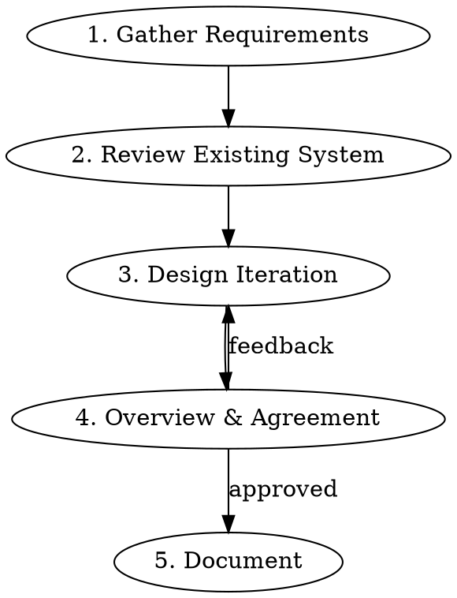

# High-Level Design

## Overview

Collaborative, incremental design process for extending an existing system. Produces a sound MVP design rooted in tradeoff analysis — simple enough to build now, extensible enough to grow later.

**Core principle:** Every design decision must name at least one alternative and explain why it was rejected. No decision survives without a tradeoff argument.

## When to Use

- Adding a significant feature to an existing codebase
- Designing a new service or component that interacts with existing systems
- Any work where data model, API shape, or storage choices need to be made before coding
- When the user says "design this", "HLD", "how should we architect", "think through the design"

**Do NOT use for:**
- Small code changes or bug fixes (use `planning-code-changes`)
- Pure investigation or exploration (use `explore-problem`)
- Implementation planning after design is done (use `writing-plans`)

## Process



### Phase 1: Gather Requirements

Ask the user for:
1. **The prompt** — what are we building? What problem does it solve?
2. **Functional requirements** — what MUST the system do?
3. **Non-functional requirements** — latency, throughput, availability, consistency, security
4. **Good-to-have features** — not in MVP, but design should accommodate them

Then YOU generate questions about requirements the user may have missed:
- Error handling and failure modes
- Data volume and growth expectations
- Multi-tenancy or isolation concerns
- Monitoring and observability needs
- Migration or backward compatibility
- Idempotency, retry semantics
- Authorization and access control

Write all gathered requirements to `harness.md`:

```markdown
# Requirements Harness

## Problem Statement
[What we're building and why]

## Functional Requirements (MVP)
- FR1: ...
- FR2: ...

## Non-Functional Requirements
- NFR1: ...
- NFR2: ...

## Good-to-Have (Post-MVP)
- GTH1: ...
- GTH2: ...

## Open Questions Resolved
- Q1: ... → Answer: ...
```

**STOP after writing harness.md. Get user confirmation before proceeding.**

### Phase 2: Review Existing System

The user provides an `existing_system.md` or equivalent context about the current system. Read it carefully.

**Default posture:** Follow existing patterns and conventions unless there is a concrete system design reason not to. If deviating, explicitly state why.

Note:
- Current data models, storage systems, and schemas
- Existing API patterns (REST, gRPC, naming conventions)
- Framework and DI patterns in use
- How similar features were previously built
- Deployment topology and service boundaries

### Phase 3: Design Iteration

Go through each design aspect **one at a time**. For each:

1. **Ask clarifying questions** specific to this aspect
2. **Propose an approach** with rationale
3. **Name 1-2 alternatives** and why they were rejected
4. **Call out pros, cons, and pitfalls** — especially around extensibility and scalability
5. **Identify edge cases** — decide if MVP solves them, and why or why not
6. **Get user agreement** before moving to next aspect

**Design aspects to cover (in order):**

#### A. Data Design
- Entity models and relationships
- Field choices and types
- Normalization vs denormalization tradeoffs
- How the model accommodates good-to-have features without schema changes
- Edge cases: missing data, duplicate entries, schema evolution

#### B. Storage
- Which storage system(s) — and why (SQL, NoSQL, cache, queue)
- Consistency model (strong, eventual)
- Partitioning and indexing strategy
- Read/write patterns and expected load
- Follow existing system's storage choices unless a design reason justifies divergence

#### C. API Design
- Endpoint or RPC method definitions
- Request/response shapes
- Error contract
- Pagination, filtering, sorting (if applicable)
- Versioning strategy
- Idempotency considerations
- Follow existing API conventions (naming, auth, error format)

#### D. System Interaction
- How new components interact with existing services
- Sync vs async communication
- Failure handling and circuit breakers
- Data flow diagram (which service calls which, in what order)
- Deployment and rollout considerations

**For each aspect, use this template in discussion:**

> **Proposed approach:** [description]
>
> **Alternative considered:** [description] — Rejected because: [reason]
>
> **Pros:** [list]
> **Cons:** [list]
>
> **Edge cases:**
> - [case]: [MVP handles / deferred — reason]
>
> **Extensibility note:** [how good-to-have features fit in later]

### Phase 4: Overview & Agreement

After all aspects are designed, present a unified overview:
- One-paragraph summary of the design
- Data flow showing how components interact end-to-end
- Key decisions and their rationale (bullet list)
- What's in MVP vs what's deferred and why

**Get explicit user agreement or collect feedback. Loop back to Phase 3 for any aspect that needs revision.**

### Phase 5: Document

Write `high_level_design_considerations.md` with this structure:

```markdown
# High-Level Design: [Feature Name]

## Summary
[2-3 sentence overview of what we're building and the design approach]

## Requirements
[Link to or inline from harness.md — FR, NFR, GTH]

## Data Design
### Chosen Approach
[Description with schema/model]
### Alternatives Considered
| Alternative | Why Rejected |
|-------------|-------------|
| ... | ... |
### Edge Cases
| Case | MVP? | Rationale |
|------|------|-----------|
| ... | Yes/Deferred | ... |

## Storage
### Chosen Approach
[Storage system, partitioning, indexing]
### Alternatives Considered
[Same table format]

## API Design
### Chosen Approach
[Endpoints/RPCs with request/response shapes]
### Alternatives Considered
[Same table format]

## System Interaction
### Chosen Approach
[Component diagram, data flow, failure handling]
### Alternatives Considered
[Same table format]

## MVP Scope vs Future
| Feature | MVP | Post-MVP | Notes |
|---------|-----|----------|-------|
| ... | x | | |
| ... | | x | Design accommodates via [mechanism] |

## Key Design Decisions
1. [Decision]: [Rationale in one sentence]
2. ...
```

## Common Mistakes

| Mistake | Fix |
|---------|-----|
| Designing everything at once | Go aspect by aspect, get agreement on each |
| Skipping alternatives | Every decision needs at least one rejected alternative |
| Ignoring existing patterns | Default to existing system patterns; deviate only with explicit reason |
| Over-engineering MVP | Build the simplest thing, but model data so extensions don't require migrations |
| Not identifying edge cases | For each aspect, ask "what happens when X is missing/duplicate/huge/empty?" |
| Good-to-have features creeping into MVP | Tag each feature explicitly as MVP or post-MVP in harness.md |
