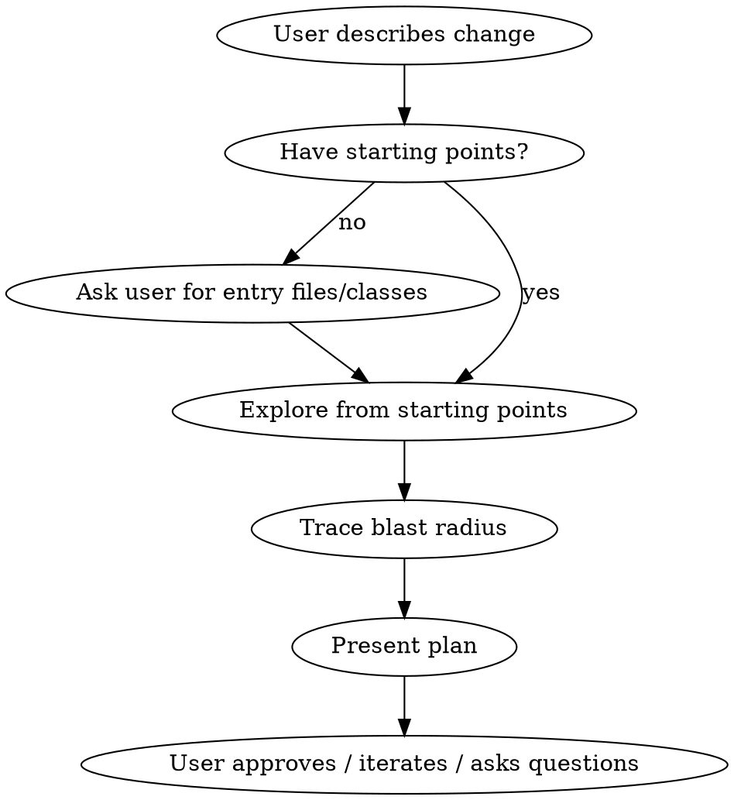

# Scoping Changes

## Overview

Scope a small code change by exploring the codebase, then present a structured plan on the terminal for the user to approve, iterate on, or ask questions about. **Do not write any code.** The output is the plan itself.

## When to Use

- User asks to "scope", "plan", or "assess" a code change
- User wants to know what files/areas would be touched before implementing
- User describes a change and asks "what would need to change?"

**Do NOT use when:**
- User explicitly asks you to implement/code the change (use implementation skills instead)
- The task is pure investigation with no planned change
- The change is a one-line fix the user already knows the location of

## Process



### 1. Understand the Problem

Read the user's request carefully. If the change goal is ambiguous, ask a clarifying question **before exploring**. Don't explore to "figure out what they mean" — ask.

### 2. Get Starting Points

If the user provided file paths or class names, start there. If not, **ask**:

> "Do you know which files or classes are involved, or should I search for the entry point?"

Do not silently start grepping the whole codebase. The user often knows where to look — asking saves time and builds shared context.

### 3. Explore (Silently)

Use Grep, Glob, and Read to trace the change. The user does not need to see your exploration steps. Keep exploration focused:

- Start from the entry point and trace outward
- Look for existing patterns to match (how similar changes were done before)
- Identify all files that would need modification
- Check for tests that cover the affected code

**Stop exploring when you can answer:** What files change? What changes in each? What tests need updating?

### 4. Present the Plan

Output a structured plan using this format:

```
## Change Plan: [one-line summary]

**Goal:** [what the change achieves]

**Files to modify:**
1. `path/to/File.java` — [what changes and why]
2. `path/to/OtherFile.java` — [what changes and why]
...

**Tests:**
- `path/to/FileTest.java` — [new test or update existing]

**Blast radius:** [low/medium — what else could be affected]
**Complexity:** [trivial/small/medium — honest assessment]

**Open questions:** [anything uncertain, optional approaches, decisions for the user]
```

**Rules for the plan:**
- List **every file** that needs modification, including tests and configs
- Each file gets a one-line description of the change, not implementation details
- If there's a Flipr flag involved, mention the namespace and flag name
- If there's a metric involved, mention the naming convention to follow
- Be honest about uncertainty — flag areas you're unsure about under "Open questions"

### 5. Wait for the User

After presenting the plan, **stop and wait**. Say:

> "Want me to proceed with this plan, adjust anything, or do you have questions?"

Do not start implementing. Do not ask if they want you to "go ahead and code it." Just present the plan and wait.

## Common Mistakes

| Mistake | Fix |
|---------|-----|
| Showing exploration steps to the user | Keep Grep/Glob/Read internal. Output only the plan. |
| Starting to code after presenting the plan | Stop after the plan. Wait for explicit approval. |
| Skipping tests in the plan | Always identify which tests need updating or creating. |
| Vague file descriptions ("update this file") | Be specific: "Add city-level guard using Flipr flag `etd_surge_disabled_cities`" |
| Not asking for starting points | Ask before searching blindly. The user usually knows. |
| Over-scoping — including "nice to have" changes | Scope only what's needed for the stated goal. |
