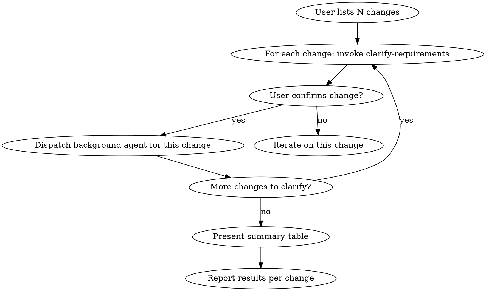

# Scoping Small Changes

## Overview

Orchestrate multiple small independent code changes: clarify each one individually, then dispatch subagents to implement them in parallel on separate branches. **Do not batch-clarify.** Each change gets its own conversation, its own branch, its own PR.

## When to Use

- User provides 2+ small independent code changes in one request
- User says "I have a few changes" or lists multiple tasks
- Changes don't depend on each other

**Do NOT use when:**
- Changes are interdependent (one requires another to be done first)
- There's only one change (use `planning-code-changes` instead)
- User wants everything in a single PR

## Process



### 1. Enumerate the Changes

List back the changes you understood from the user's request. Number them. Ask: "Is this the complete list, or did I miss anything?"

### 2. Clarify and Dispatch Incrementally

Go through each change **one by one** and invoke `clarify-requirements` for each. Do not batch them. Each change may have different:
- Ambiguities
- Risk levels
- Starting points in the code
- Questions for the user

**As soon as a change is fully clarified and confirmed by the user**, dispatch a background agent for it immediately — don't wait for the other changes to be clarified. This runs implementation in parallel with ongoing clarification.

For each confirmed change:
1. Show the user: `"Starting [change description] on branch [branch-name] in the background."`
2. Dispatch a background agent (via the Agent tool with `run_in_background: true`) that:
   - Creates its own branch from `main`
   - Implements only its assigned change
   - Runs relevant tests
3. Continue clarifying the next change

### 3. Present a Summary Table

After all changes are clarified and dispatched, present a summary:

```
| # | Change | Branch Name | Key Files | Status |
|---|--------|-------------|-----------|--------|
| 1 | [description] | `branch-name-1` | `path/File.java` | dispatched |
| 2 | [description] | `branch-name-2` | `path/Other.java` | dispatched |
```

### 4. Report Results

After all agents complete, summarize:

```
| # | Change | Branch | Status |
|---|--------|--------|--------|
| 1 | [description] | `branch-name-1` | done |
| 2 | [description] | `branch-name-2` | done |
```

Offer to create PRs for each branch.

## Common Mistakes

| Mistake | Fix |
|---------|-----|
| Clarifying all changes at once in one batch | Clarify each change individually — they have different questions |
| Putting all changes on one branch | One branch per change. Always. |
| Waiting for ALL changes to be clarified before dispatching any | Dispatch each change as a background agent as soon as it's confirmed — overlap clarification with implementation |
| Skipping the summary table | The user needs to see the full picture after all changes are dispatched |
| Not asking if the list is complete | User may have forgotten a change — confirm the list first |
